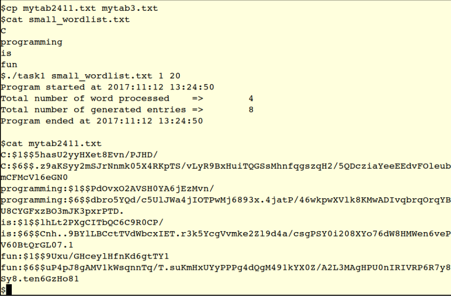
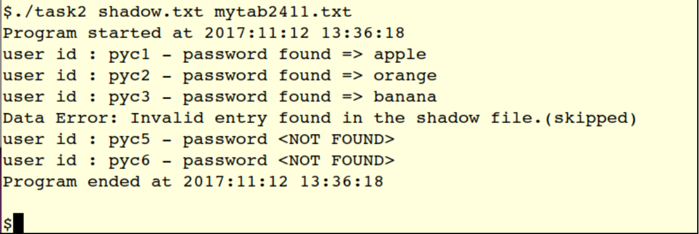

# C Assignment

Remember to link crypt library and openmp using `-lcrypt` and `-fopenmp` when compiling.

## Cryptographic hash lookup generator
 
> Execution Time using 8 threads: 48s (wordlist.txt)

* Add option to choose number of threads to use
* Add option for output path
* Improve readability
* ~~Add multithreading~~
* ~~Use file command to validate input file is a text file~~
* ~~if system do not have file command check for txt extension~~

##  Password Recovery Utility
 
> Runtime: 804s

* Parse data into username and password
* Check if the format of the file is valid while parsing
* Display invalid entries
* Improve efficiency by only check for the correct hashing algorithm
* Add multithreading
