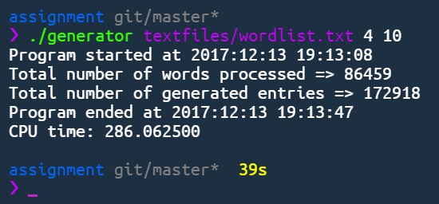
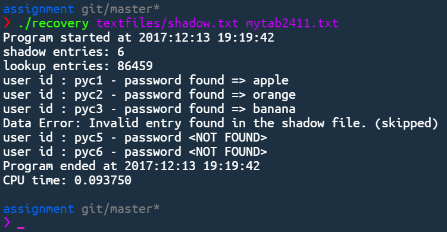

# C Assignment

Run make all to compile.

## Cryptographic hash lookup generator
 
> Execution Time using 8 threads: 48s (wordlist.txt)

* ~~Change default output filename to  'mytab2411.txt'~~
* ~~Use threadsafe version of crypt (crypt_r)~~
* ~~Add multithreading~~
* ~~Use file command to validate input file is a text file~~
* ~~if system do not have file command check for txt extension~~

##  Password Recovery Utility
 
> Runtime: less than 1 second

* ~~Parse data into username and password~~
* ~~Display invalid entries~~
* ~~Improve efficiency by only check for the correct hashing algorithm~~
